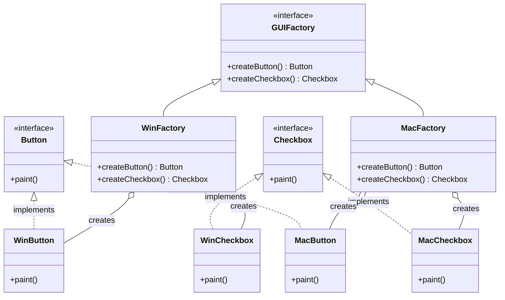

# Abstract Factory Pattern

The Abstract Factory is a creational design pattern that provides an interface for creating families of related or dependent objects without specifying their concrete classes. This pattern is useful when your code needs to work with various families of related products, but you don’t want it to depend on the concrete classes of those products—they might be unknown beforehand or you simply want to allow for future extensibility.

---

## Intent
- Provide an interface for creating families of related or dependent objects without specifying their concrete classes.
- Ensure that products created by a factory are compatible with each other.

## Problem
Suppose you are building a cross-platform UI library. You want to create UI elements (like buttons and checkboxes) that look and behave consistently within the same family (e.g., Windows or MacOS). However, you don’t want to hard-code the platform-specific classes into your core logic. The Abstract Factory pattern allows you to create families of related objects (buttons, checkboxes, etc.) for each platform, keeping your code flexible and extensible.

## Solution
The Abstract Factory pattern suggests defining an interface for creating each distinct product of a product family. Concrete factories implement these interfaces to create products of a specific family. The client code works with factories and products only through their abstract interfaces, remaining decoupled from the actual product classes.

---

## Structure
For the UI library example, the Abstract Factory pattern organizes the code as follows:

- **Button, Checkbox (Product):** Declare interfaces for UI elements.
- **WinButton, WinCheckbox, MacButton, MacCheckbox (ConcreteProduct):** Implement the product interfaces for specific platforms.
- **GUIFactory (AbstractFactory):** Declares creation methods for each product.
- **WinFactory, MacFactory (ConcreteFactory):** Implement creation methods to instantiate platform-specific products.

This structure allows the client code to work with the GUIFactory, Button, and Checkbox interfaces, remaining decoupled from the concrete UI element types.

---

## Pros
- Ensures consistency among products in a family.
- Isolates concrete classes from client code.
- Supports the Open/Closed Principle.

## Cons
- Adding new product families requires changing the abstract factory and all concrete factories.
- Can introduce more classes and complexity.

---

## Applicability
Use the Abstract Factory pattern when:
- Your code needs to work with various families of related products, but you don’t want it to depend on the concrete classes of those products.
- You want to ensure that products from the same family are used together.
- You want to provide a library of products, revealing only their interfaces, not their implementations.

---

## References
- [Refactoring Guru: Abstract Factory](https://refactoring.guru/design-patterns/abstract-factory)
---

* See the `TypeScript/` folder for implementation examples.
* See the `CSharp/` folder for implementation examples.
* See the `Go/` folder for implementation examples.
