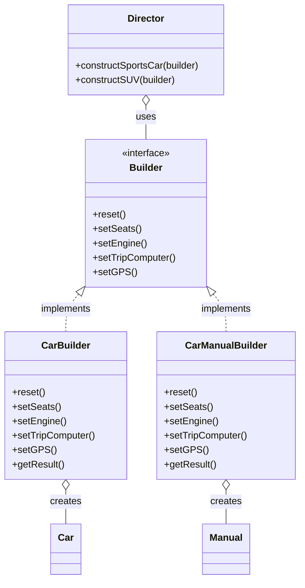

# Builder Pattern

The Builder is a creational design pattern that lets you construct complex objects step by step. The pattern allows you to produce different types and representations of an object using the same construction code.

---

## Intent
- Separate the construction of a complex object from its representation so that the same construction process can create different representations.

## Problem
Suppose you need to create complex objects (like cars or houses) that require multiple steps to construct and may have many optional parts. If you use a constructor with many parameters, the code becomes hard to read and maintain. The Builder pattern solves this by extracting the object construction code out of its own class and moving it to separate builder objects.

## Solution
The Builder pattern suggests moving the construction logic to separate builder classes. The Director class defines the order in which to call construction steps, while the builder provides the implementation for those steps. The same construction process can create different representations of the object.

---

## Structure
For the car example, the Builder pattern organizes the code as follows:

- **Builder (interface):** Specifies methods for creating the different parts of the product.
- **ConcreteBuilder:** Implements the builder interface and provides specific implementations for the construction steps.
- **Director:** Defines the order in which to call construction steps.
- **Product:** The complex object being built.

This structure allows the client code to create different products using the same construction process.

---

## Pros
- You can construct objects step by step, defer construction steps, or run steps recursively.
- You can reuse the same construction code for different representations of products.
- Isolates complex construction code from the product’s business logic.

## Cons
- The overall complexity of the code increases since the pattern requires creating multiple new classes.

---

## Applicability
Use the Builder pattern when:
- You want to construct complex objects step by step.
- You want to create different representations of a product using the same construction process.
- Your code needs to create different views of the same product (e.g., car and car manual).

---

## References
- [Refactoring Guru: Builder](https://refactoring.guru/design-patterns/builder)
---

* See the `TypeScript/` folder for implementation examples.
* See the `CSharp/` folder for implementation examples.

