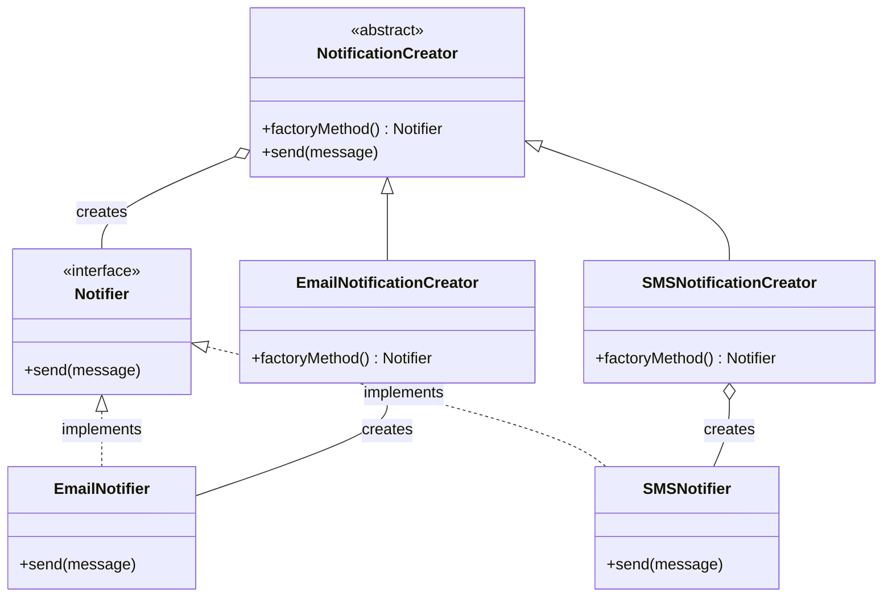

# Factory Method Pattern

The Factory Method is a creational design pattern that provides an interface for creating objects in a superclass, but allows subclasses to alter the type of objects that will be created. This pattern helps promote loose coupling by eliminating the need to bind application-specific classes into your code.

---

## Intent
- Define an interface for creating an object, but let subclasses decide which class to instantiate.
- Lets a class defer instantiation to subclasses.

## Problem
Imagine you’re developing a library for notifications. The library should be able to send notifications via different channels (email, SMS, push, etc.), but you don’t want to hard-code the notification types into the core logic. The Factory Method pattern allows you to delegate the instantiation of notification objects to subclasses, making your code more flexible and extensible.

## Solution
The Factory Method pattern suggests replacing direct object construction calls (using `new`) with calls to a special factory method. Objects are created by calling this method, which can be overridden in subclasses to produce different types of products.

---

## Structure
To address the notification library problem described above, the Factory Method pattern organizes the code into the following structure:

- **Notifier (Product):** Declares the interface for sending notifications.
- **EmailNotifier, SMSNotifier (ConcreteProduct):** Implement the Notifier interface for specific channels.
- **NotificationCreator (Creator):** Declares the factory method that returns a Notifier. May include core logic that uses the Notifier.
- **EmailNotificationCreator, SMSNotificationCreator (ConcreteCreator):** Override the factory method to instantiate the appropriate Notifier (Email or SMS).

This structure allows the client code to work with the NotificationCreator and Notifier interfaces, remaining decoupled from the concrete notification types.

---

## Pros
- Isolates object creation code in one place.
- Makes code more flexible and extensible.
- Supports the Open/Closed Principle.

## Cons
- May require creating a new subclass for each type of product.
- Can introduce more classes and complexity.

---

## Applicability
Use the Factory Method pattern when:
- You don’t know beforehand the exact types and dependencies of the objects your code should work with.
- You want to provide users of your library or framework with a way to extend its internal components.
- You want to save system resources by reusing existing objects instead of rebuilding them each time.

---

## References
- [Refactoring Guru: Factory Method](https://refactoring.guru/design-patterns/factory-method)
---

* See the `TypeScript/` folder for implementation examples.
* See the `CSharp/` folder for implementation examples.
