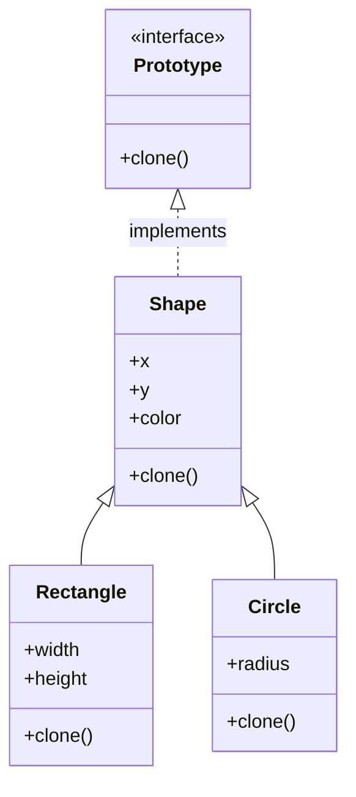

# Prototype Pattern

The Prototype is a creational design pattern that lets you copy existing objects without making your code dependent on their classes. This pattern is especially useful when the cost of creating a new object is more expensive than copying an existing one, or when you want to avoid building a complex object from scratch.

---

## Intent
- Specify the kinds of objects to create using a prototypical instance, and create new objects by copying this prototype.
- Avoid subclasses of an object creator in the client code.

## Problem
Suppose you have objects that are expensive to create or have complex initialization. You want to be able to duplicate these objects efficiently, without coupling your code to their concrete classes. The Prototype pattern allows you to clone objects, even complex ones, without depending on their concrete classes.

## Solution
The Prototype pattern suggests adding a cloning method to your objects. Instead of instantiating a new object directly, you call the clone method on an existing object, which returns a copy of itself. This approach allows you to create new objects by copying existing ones, keeping your code flexible and decoupled from specific classes.

---

## Structure
For the shape example, the Prototype pattern organizes the code as follows:

- **Prototype (interface):** Declares the clone method.
- **ConcretePrototype:** Implements the clone method.
- **Client:** Creates a new object by copying a prototype.

This structure allows the client code to clone objects without knowing their concrete classes.

---

## Pros
- You can clone objects without coupling to their concrete classes.
- You can avoid repetitive initialization code.
- You can reduce the number of subclasses needed for object creation.

## Cons
- Cloning complex objects that reference other objects can be tricky (deep vs. shallow copy).
- Requires implementing a clone method in each class.

---

## Applicability
Use the Prototype pattern when:
- Objects to be created are similar to existing ones.
- The cost of creating a new object is more expensive than copying an existing one.
- You want to avoid building a complex object from scratch.

---

## References
- [Refactoring Guru: Prototype](https://refactoring.guru/design-patterns/prototype)
---

* See the `TypeScript/` folder for implementation examples.
* See the `CSharp/` folder for implementation examples.

