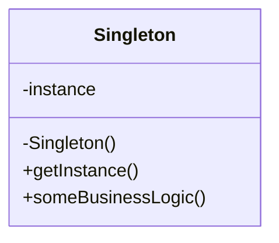

# Singleton Pattern

The Singleton is a creational design pattern that ensures a class has only one instance and provides a global point of access to it. This pattern is useful when you need exactly one object to coordinate actions across the system, such as a configuration manager or a database connection.

---

## Intent
- Ensure a class has only one instance.
- Provide a global point of access to that instance.

## Problem
Sometimes, it is important to have exactly one instance of a class. For example, a configuration object or a database connection manager. If you create multiple instances, there may be inconsistencies or wasted resources.

## Solution
The class itself is responsible for keeping a reference to its sole instance. The instance is created the first time it is requested and then reused. Access is provided through a static method.

---

## Structure
The Singleton is usually implemented with:
- A private constructor to prevent external instantiation.
- A static field to store the unique instance.
- A static method to access the instance.

---

## Pros
- Guarantees a single instance.
- Global access to the instance.
- Can be extended to implement lazy initialization and thread safety.

## Cons
- Can make unit testing difficult (due to global state).
- Can hide system dependencies.

---

## Applicability
Use the Singleton when:
- You need exactly one instance of a class.
- You need a global point of access to that instance.

---

## References
- [Refactoring Guru - Singleton](https://refactoring.guru/design-patterns/singleton)

---

* See the `TypeScript/` folder for implementation examples.
* See the `CSharp/` folder for implementation examples.
* See the `Go/` folder for implementation examples.
