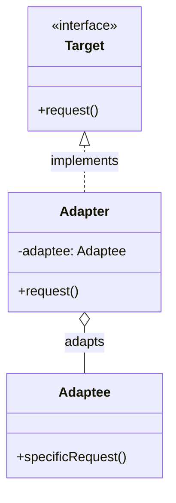

# Adapter Pattern

The Adapter is a structural design pattern that allows objects with incompatible interfaces to collaborate. It acts as a wrapper between two objects, translating requests so that they can work together without changing their existing code.

---

## Intent
- Allow objects with incompatible interfaces to work together.
- Convert the interface of a class into another interface clients expect.

## Problem
Suppose you are integrating a third-party library into your application, but its interface is different from what your code expects. Changing your code to match the new interface may be impractical or impossible. The Adapter pattern lets you create a wrapper that adapts the third-party interface to your own, enabling seamless integration.

## Solution
The Adapter pattern suggests creating a new class (the Adapter) that implements the interface your code expects and wraps the object with the incompatible interface. The Adapter translates calls from your code into calls that the wrapped object understands.

---

## Structure
For example, imagine you have a client that expects to work with a `Target` interface, but you need to use an `Adaptee` class with a different interface. The Adapter implements the `Target` interface and internally uses an instance of `Adaptee` to fulfill requests.

This structure allows the client to work with the `Target` interface, while the Adapter handles the translation to the `Adaptee` interface.

---

## Pros
- Allows integration of legacy or third-party code without modifying existing code.
- Promotes code reusability and flexibility.
- Follows the Single Responsibility Principle by separating interface adaptation from business logic.

## Cons
- Can introduce additional complexity with extra classes.
- Overuse may lead to code that is harder to understand and maintain.

---

## Applicability
Use the Adapter pattern when:
- You want to use an existing class, but its interface does not match what you need.
- You need to integrate classes with incompatible interfaces.
- You want to reuse legacy code in a new system with a different interface.

---

## References
- [Refactoring Guru: Adapter](https://refactoring.guru/design-patterns/adapter)
---

* See the `TypeScript/` folder for implementation examples.
* See the `CSharp/` folder for implementation examples.

