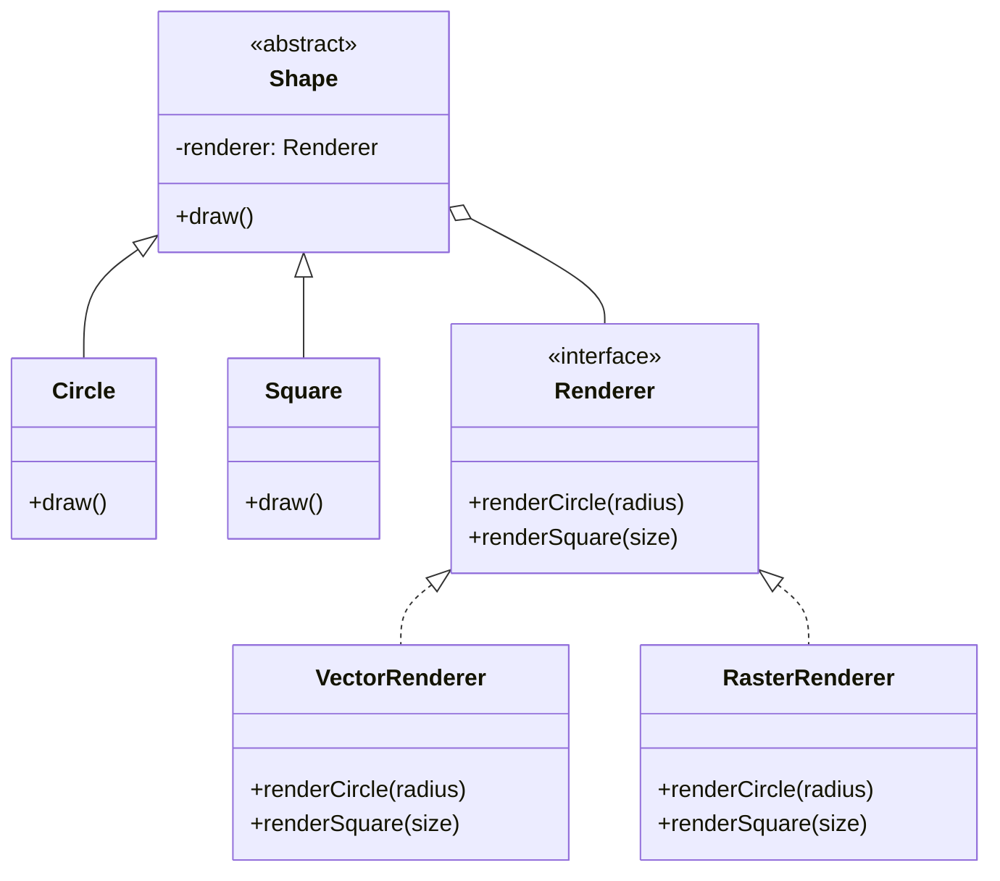

# Bridge Pattern

The Bridge is a structural design pattern that lets you split a large class or a set of closely related classes into two separate hierarchies—abstraction and implementation—which can be developed independently of each other. This pattern is especially useful when you want to avoid a permanent binding between an abstraction and its implementation, allowing them to vary independently.

---

## Intent
- Decouple an abstraction from its implementation so that the two can vary independently.
- Improve code extensibility by separating concerns.

## Problem
Suppose you are developing a graphical application that supports different operating systems and different rendering APIs. If you try to create a separate class for each combination of abstraction (e.g., shapes) and implementation (e.g., rendering APIs), the number of classes grows rapidly. The Bridge pattern helps you avoid this explosion by separating the abstraction (shapes) from the implementation (renderers).

## Solution
The Bridge pattern suggests splitting the code into two independent hierarchies:
- **Abstraction**: Defines the high-level control logic and maintains a reference to the implementation object.
- **Implementation**: Contains the low-level platform-specific code.

The abstraction delegates all the real work to the implementation object. Both hierarchies can be extended independently.

---

## Structure
For the graphics example, the Bridge pattern organizes the code as follows:

- **Shape (Abstraction):** Declares the interface and maintains a reference to the implementation.
- **Circle, Square (RefinedAbstraction):** Extend the abstraction.
- **Renderer (Implementation):** Declares the interface for implementation classes.
- **VectorRenderer, RasterRenderer (ConcreteImplementation):** Implement the rendering logic for different APIs.

This structure allows you to mix and match shapes and renderers without creating a class for every combination.

---

## Pros
- Decouples abstraction from implementation.
- Both abstraction and implementation can be extended independently.
- Reduces code duplication.

## Cons
- Increases complexity due to the need for multiple abstraction and implementation classes.

---

## Applicability
Use the Bridge pattern when:
- You want to avoid a permanent binding between an abstraction and its implementation.
- Both the abstractions and their implementations should be extensible by subclassing.
- Changes in the implementation of an abstraction should have no impact on clients.

---

## References
- [Refactoring Guru: Bridge](https://refactoring.guru/design-patterns/bridge)
---

* See the `TypeScript/` folder for implementation examples.
* See the `CSharp/` folder for implementation examples.

