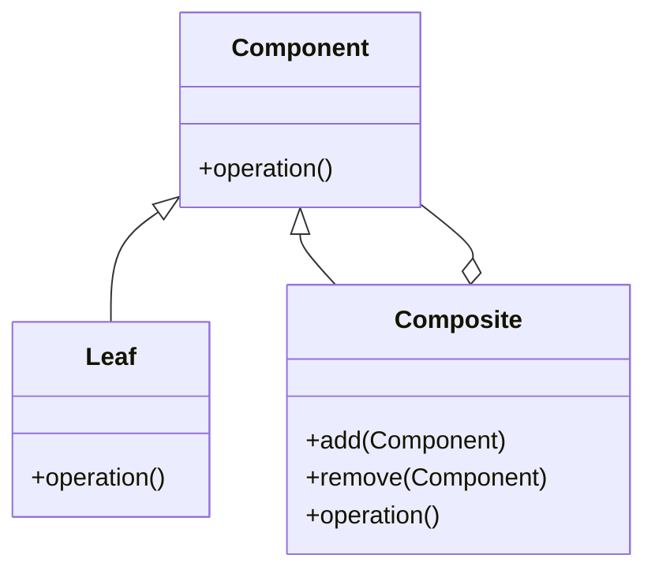

# Composite Pattern

The Composite is a structural design pattern that lets you compose objects into tree structures to represent part-whole hierarchies. Composite lets clients treat individual objects and compositions of objects uniformly.

---

## Intent
- Compose objects into tree structures to represent part-whole hierarchies.
- Allow clients to treat individual objects and compositions uniformly.

## Problem
Suppose you have to work with a tree-like structure, such as a graphical scene, a file system, or an organization chart. You want to be able to treat both individual objects (leaves) and groups of objects (composites) in the same way, without writing code that distinguishes between them.

## Solution
The Composite pattern organizes objects into tree structures. Both individual objects and groups of objects implement a common interface, so they can be treated uniformly. The composite object delegates work to its children and manages their hierarchy.

---

## Structure
- **Component:** Declares the interface for objects in the composition.
- **Leaf:** Represents leaf objects in the composition (no children).
- **Composite:** Represents complex components that may have children. Implements child-related operations.

This structure allows you to build complex tree structures and treat all elements uniformly.

---

## Pros
- Simplifies client code by treating all elements uniformly.
- Makes it easier to add new kinds of components.
- Supports recursive structures.

## Cons
- Can make the design overly general, making it harder to restrict the types of components in a composite.

---

## Applicability
Use the Composite pattern when:
- You want to represent part-whole hierarchies of objects.
- You want clients to treat individual objects and compositions uniformly.

---

## References
- [Refactoring Guru: Composite](https://refactoring.guru/design-patterns/composite)
---

* See the `TypeScript/` folder for implementation examples.
* See the `CSharp/` folder for implementation examples.
* See the `Go/` folder for implementation examples.

