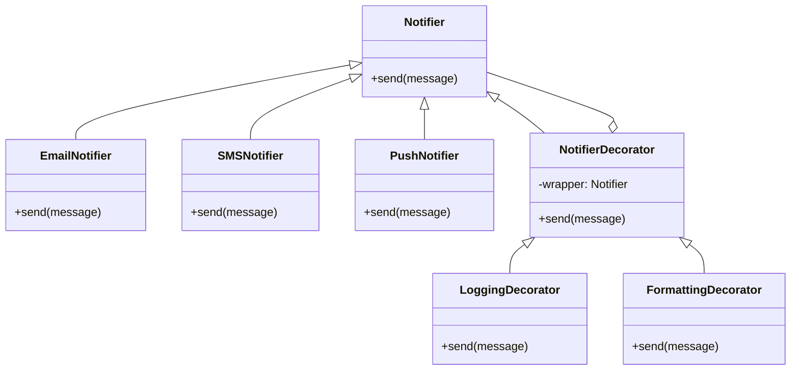

# Decorator Pattern

The Decorator is a structural design pattern that lets you attach new behaviors to objects by placing these objects inside special wrapper objects, called decorators. Decorators provide a flexible alternative to subclassing for extending functionality.

---

## Intent
- Attach additional responsibilities to an object dynamically.
- Provide a flexible alternative to subclassing for extending functionality.

## Problem
Suppose you have a notification system that supports different types of notifications, such as Email, SMS, and Push. Over time, you want to add new features, such as logging, formatting, or filtering messages, but you don't want to create a new subclass for every combination of notification type and feature. The Decorator pattern allows you to add these features dynamically by wrapping the notification object in decorator objects.

## Solution
The Decorator pattern suggests creating a set of decorator classes that are used to wrap concrete components. For example, you can have a base `Notifier` interface, concrete implementations like `EmailNotifier`, `SMSNotifier`, and `PushNotifier`, and decorators like `LoggingDecorator` and `FormattingDecorator`. Each decorator implements the same interface and adds its own behavior before or after delegating to the wrapped object.

---

## Structure
- **Notifier (Component):** Declares the interface for sending notifications.
- **EmailNotifier, SMSNotifier, PushNotifier (ConcreteComponent):** Send notifications via different channels.
- **NotifierDecorator (Decorator):** Maintains a reference to a notifier object and implements the notifier interface.
- **LoggingDecorator, FormattingDecorator (ConcreteDecorators):** Add responsibilities to the notification, such as logging or formatting.

This structure allows you to add new behavior to notifications at runtime by wrapping them in one or more decorators.

---

## Pros
- More flexible than subclassing.
- Can add or remove responsibilities at runtime.
- Can combine several behaviors by wrapping in multiple decorators.

## Cons
- Can result in many small objects in the program.
- The order of decorators can matter and be hard to manage.

---

## Applicability
Use the Decorator pattern when:
- You need to add responsibilities to objects dynamically and transparently.
- Extending functionality by subclassing is impractical.

---

## References
- [Refactoring Guru: Decorator](https://refactoring.guru/design-patterns/decorator)
---

* See the `TypeScript/` folder for implementation examples.
* See the `CSharp/` folder for implementation examples.
* See the `Go/` folder for implementation examples.
