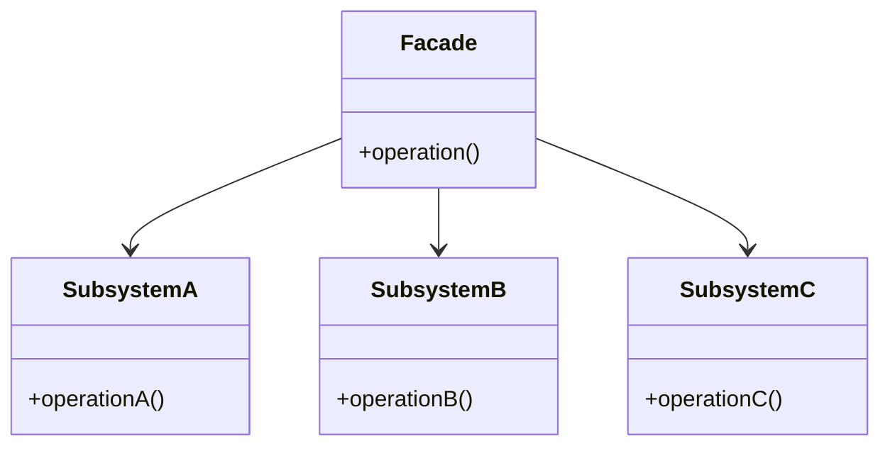

# Facade Pattern

The Facade is a structural design pattern that provides a simplified interface to a complex subsystem. It defines a higher-level interface that makes the subsystem easier to use.

---

## Intent
- Provide a unified and simple interface to a set of interfaces in a subsystem.
- Make a subsystem easier to use by hiding its complexity.

## Problem
Suppose you have a complex library or framework with many classes and interactions, such as a multimedia conversion library. Using it directly requires deep knowledge of its internals. The Facade pattern allows you to create a single class that wraps this complexity and exposes only what the client needs, making the system easier to use and reducing dependencies on the subsystem's details.

## Solution
The Facade pattern suggests introducing a facade class that wraps the subsystem and delegates client requests to the appropriate subsystem objects. The facade provides simple methods for common tasks, while the subsystem classes handle the actual work.

---

## Structure
- **Facade:** Provides simple methods for clients and delegates calls to subsystem objects.
- **Subsystem Classes:** Implement complex functionality and are called by the facade.

This structure allows clients to interact with a single, simple interface instead of multiple subsystem classes.

---

## Pros
- Simplifies the usage of complex subsystems.
- Reduces dependencies between clients and subsystems.
- Promotes loose coupling.

## Cons
- Can become a "god object" if it tries to do too much.
- May limit access to advanced subsystem features.

---

## Applicability
Use the Facade pattern when:
- You want to provide a simple interface to a complex subsystem.
- You want to decouple clients from subsystem implementation details.

---

## References
- [Refactoring Guru: Facade](https://refactoring.guru/design-patterns/facade)
---

* See the `TypeScript/` folder for implementation examples.
* See the `CSharp/` folder for implementation examples.
* See the `Go/` folder for implementation examples.

